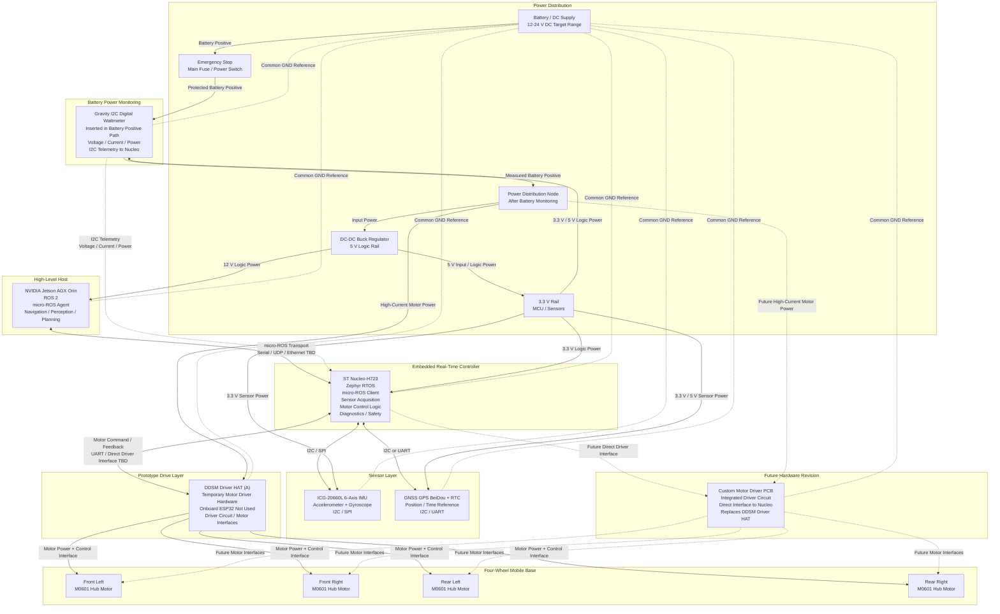

# Zephyr micro-ROS Robot Control Firmware

This repository contains the embedded firmware for a Zephyr RTOS based robot control project.  
The project aims to provide low-level control and sensor acquisition for a four-wheel mobile robot and/or robotic arm platform, using **micro-ROS** to communicate with a central host computer.

The current target host is a **NVIDIA Jetson AGX Orin**, which will run the high-level ROS 2 stack, while the embedded controller handles real-time motor control coordination, sensor data acquisition, and telemetry publishing.

> Status: Work in progress / early hardware integration stage.

---

## Project Overview

The system is designed around a distributed control architecture:

- A **Nucleo-H723AG** board runs Zephyr RTOS and micro-ROS firmware.
- A **DDSM Driver HAT** is used as the initial off-the-shelf motor driver solution for the hub motors.
- The Nucleo board reads onboard sensors such as IMU, GNSS, and power measurement modules.
- The Nucleo board communicates with the DDSM Driver HAT to control the wheel motors.
- Sensor data and robot state are transmitted to the central host through micro-ROS.
- The central host, currently planned as a Jetson AGX Orin, runs the ROS 2 control, navigation, perception, and high-level decision-making stack.

---

## Target Platform

### Embedded Controller

- **Board:** ST Nucleo-H723AG
- **RTOS:** Zephyr RTOS
- **Middleware:** micro-ROS
- **Main responsibilities:**
  - Sensor acquisition
  - Motor driver communication
  - Low-level command handling
  - Telemetry publishing
  - Interface with the ROS 2 host

### Central Host

- **Host:** NVIDIA Jetson AGX Orin
- **Expected software stack:**
  - Ubuntu
  - ROS 2
  - micro-ROS Agent
  - Navigation / perception / robot control software

---

## Hardware Components

The current hardware setup includes the following components.

### Motor and Drive System

| Component | Quantity | Purpose |
|---|---:|---|
| M0601 Direct-Drive Hub Motor for AGV, Right Orientation, Integrated FOC Servo | 2 | Wheel actuation |
| M0601 Direct-Drive Hub Motor for AGV, Left Orientation, Integrated FOC Servo | 2 | Wheel actuation |
| DDSM Driver HAT (A) | 1 | Motor driver board for DDSM series hub motors |
| All-metal Compact UGV Suspension (A) | 4 | Mechanical suspension for the mobile robot platform |

> Note: The final four-wheel configuration and motor orientation layout are still under development.

### Sensors

| Component | Quantity | Interface | Purpose |
|---|---:|---|---|
| Gravity GNSS GPS BeiDou Positioning Module with RTC | 1 | I2C / UART | Global positioning and time reference |
| Fermion ICG 20660L Accel + Gyro 6-Axis IMU Module | 1 | SPI | Inertial measurement |
| Gravity I2C Digital Wattmeter | 1 | I2C | Voltage, current, power monitoring |

---

## System Architecture

## System Architecture

The current prototype uses the Nucleo-H723 board as the main embedded real-time controller. The Nucleo board runs Zephyr RTOS and micro-ROS, reads the onboard sensors, monitors battery power through the I2C wattmeter, and communicates with the motor driver hardware.

The Jetson AGX Orin is planned as the high-level ROS 2 host. It runs the micro-ROS Agent, navigation, perception, planning, and other high-level robot software.

During the prototyping stage, the DDSM Driver HAT is used only as temporary motor driver hardware for the hub motors. The onboard ESP32 on the Driver HAT is not used in this project architecture. Motor control logic is handled by the Nucleo firmware. In a future hardware revision, the Driver HAT will be replaced by a custom motor driver PCB with the required driver circuit integrated directly into the robot electronics.

The Gravity I2C Digital Wattmeter is connected directly in series with the battery positive output path. This allows the Nucleo board to read battery voltage, current, and power telemetry over I2C.



```text
                                      +--------------------------------+
                                      |        Jetson AGX Orin         |
                                      |--------------------------------|
                                      | ROS 2                          |
                                      | micro-ROS Agent                |
                                      | Navigation / Perception        |
                                      | Planning / High-Level Control  |
                                      +----------------+---------------+
                                                       |
                                                       | micro-ROS transport
                                                       | Serial / UDP / Ethernet TBD
                                                       |
                                      +----------------v---------------+
                                      |       ST Nucleo-H723 Board     |
                                      |--------------------------------|
                                      | Zephyr RTOS                    |
                                      | micro-ROS Client               |
                                      | Sensor Acquisition             |
                                      | Battery Power Telemetry        |
                                      | Motor Control Logic            |
                                      | Diagnostics / Safety           |
                                      +---------+------------+---------+
                                                |            |
                                                |            |
                          I2C / SPI / UART      |            | Motor command / feedback
                                                |            | UART / direct driver interface TBD
                                                |            |
                  +-----------------------------v--+      +--v--------------------------------+
                  |          Sensor Layer          |      |       Prototype Drive Layer       |
                  |--------------------------------|      |-----------------------------------|
                  | ICG-20660L 6-Axis IMU          |      | DDSM Driver HAT (A)               |
                  |  - Accelerometer + Gyroscope   |      |                                   |
                  |  - I2C / SPI                   |      | Used as temporary motor driver    |
                  |                                |      | hardware for prototyping.         |
                  | GNSS GPS BeiDou + RTC          |      |                                   |
                  |  - Position / time reference   |      | Onboard ESP32 is not used.        |
                  |  - I2C / UART                  |      |                                   |
                  +--------------------------------+      | Nucleo handles motor control      |
                                                          | logic and ROS communication.      |
                                                          +---------+-----------+-------------+
                                                                    |           |
                                                                    |           |
                                                                    | Motor power + control
                                                                    |
                               +------------------------------------+-------------------------+
                               |                         Four-Wheel Mobile Base               |
                               |--------------------------------------------------------------|
                               |                                                              |
                               |   +----------------+                 +----------------+      |
                               |   | Front Left     |                 | Front Right    |      |
                               |   | M0601 Hub      |                 | M0601 Hub      |      |
                               |   | Motor          |                 | Motor          |      |
                               |   +----------------+                 +----------------+      |
                               |                                                              |
                               |   +----------------+                 +----------------+      |
                               |   | Rear Left      |                 | Rear Right     |      |
                               |   | M0601 Hub      |                 | M0601 Hub      |      |
                               |   | Motor          |                 | Motor          |      |
                               |   +----------------+                 +----------------+      |
                               |                                                              |
                               +--------------------------------------------------------------+


        +--------------------------------------------------------------------------------------+
        |                                  Power Distribution                                  |
        |--------------------------------------------------------------------------------------|
        |                                                                                      |
        |   Battery / DC Supply                                                                |
        |   Target range: 12-24 V DC for current DDSM115-based prototype                       |
        |             |                                                                        |
        |             | Battery positive                                                       |
        |             v                                                                        |
        |   Emergency Stop / Main Fuse / Power Switch                                          |
        |             |                                                                        |
        |             | Protected battery positive                                             |
        |             v                                                                        |
        |   Gravity I2C Digital Wattmeter                                                      |
        |   - Connected directly in series with the battery positive output path               |
        |   - Measures battery voltage, current, and power                                     |
        |   - Reports telemetry to Nucleo over I2C                                             |
        |             |                                                                        |
        |             | Measured battery positive                                              |
        |             v                                                                        |
        |   Power Distribution Node                                                            |
        |             |                                                                        |
        |             +-----------------------------> High-current motor power                 |
        |             |                               to DDSM Driver HAT                       |
        |             |                                                                        |
        |             +-----------------------------> DC-DC Buck Regulator                     |
        |                                               |                                      |
        |                                               +--> 12 V logic rail                   |
        |                                               |    - Jetson                          |
        |                                               |                                      |
        |                                               +--> 3.3 V rail                        |
        |                                                    - Nucleo-H723                     |
        |                                                    - IMU                             |
        |                                                    - GNSS module                     |
        |                                                    - Wattmeter logic                 |
        |                                                                                      |
        |   Common ground reference should be shared by:                                       |
        |   Battery, Wattmeter, Nucleo, DDSM Driver HAT, sensors, and Jetson.                  |
        |                                                                                      |
        +--------------------------------------------------------------------------------------+


        +--------------------------------------------------------------------------------------+
        |                              Future Hardware Revision                                |
        |--------------------------------------------------------------------------------------|
        |                                                                                      |
        |   Current prototype:                                                                 |
        |                                                                                      |
        |       Nucleo-H723  --->  DDSM Driver HAT  --->  Four M0601 Hub Motors                |
        |                                                                                      |
        |   Future revision:                                                                   |
        |                                                                                      |
        |              Custom Motor Driver PCB  --->  Four M0601 Hub Motors                    |
        |                                                                                      |
        |   The custom motor driver PCB will integrate the required driver circuit and replace |
        |   the temporary DDSM Driver HAT used during early prototyping.                       |
        |                                                                                      |
        +--------------------------------------------------------------------------------------+
```